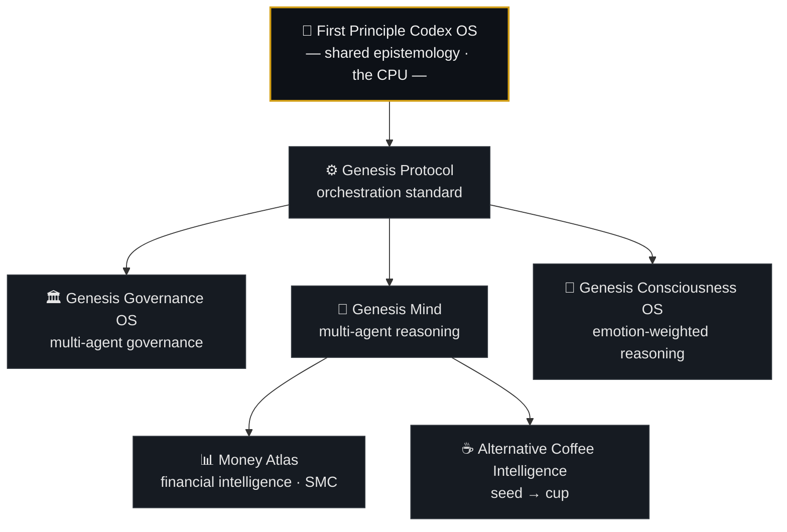

<!--
  Profile README — github.com/ElmatadorZ
  Repo name MUST be exactly: ElmatadorZ
  Canonical entity: Bunyawat Dechanon (ElmatadorZ)
  License: Open Cognitive License v1.0
-->

<div align="center">

# Bunyawat Dechanon · `ElmatadorZ`

### Independent Cognitive Infrastructure Architect

Designing cognitive operating systems, agent-governance frameworks,
and reusable reasoning protocols for AI systems.

***Models evolve. Protocols endure.***

<br/>


`Cognitive OS` · `Multi-Agent Systems` · `Agent Governance` · `Epistemology Engineering` · `Market Structure` · `Coffee Science`

📍 Kamphaeng Phet, Thailand
🌐 [Money Atlas](https://www.facebook.com/MoneyAtlas9) · ☕ [Alternative Slowbar : Roaster](https://www.facebook.com/alternative.roasters/) · ▶️ [YouTube](https://youtube.com/@moneyatlas911) · 🎵 [TikTok](https://www.tiktok.com/@money.atlas)

</div>

---

## What this account is

Most AI work optimizes the **model**. This ecosystem optimizes the **reasoning** —
cognitive infrastructure that stays reliable when models change, context changes,
incentives change, and environments change.

The repositories here are **one system, not seven projects.** They inherit a single
epistemological foundation — the **First Principle Codex OS** — and every domain skill
obeys the same rules: separate Known from Inferred from Unknown, run a non-skippable
self-critique gate before output, and state confidence honestly.

I don't publish prompts. I publish **operating systems for structured reasoning**,
written as `SKILL.md` protocols that run on any instruction-following model.

---

## Ecosystem architecture



The base layer cannot be removed by any skill that inherits it. Domain skills may *add*
reasoning layers; they may not *skip* the Reality Anchor, the proof standard, or the
self-critique gate. That contract is what keeps answers consistent across domains.

---

## Repositories

| System | What it does | Apply it to |
|---|---|---|
| **[First Principle Codex OS](https://github.com/ElmatadorZ/FirstPrincipleCodex-OS-Skill)** | Anti-hallucination cognitive base layer. Every other skill inherits it — Known/Inferred/Unknown separation, 10-point proof standard, mandatory self-critique gate before any output. | Any task where being wrong is expensive — research synthesis, due diligence, claims that must hold up. |
| **[Money Atlas — Claude Skill Agent](https://github.com/ElmatadorZ/MoneyAtlas-ClaudeSkill-Agent)** | Financial intelligence for markets, macro, and geopolitics. Genesis Protocol reasoning + Smart Money Concepts layer → structured scenarios with explicit entry/exit zones and stated uncertainty. | Market structure reads, macro framing, trade-thesis stress-testing — *not* signal-following. |
| **[Genesis Mind — Claude Skill Agent](https://github.com/ElmatadorZ/Genesis-Mind-ClaudeSkill-Agent)** | Multi-agent reasoning OS: specialist-agent coordination, consensus, meta-cognition, recursive self-evaluation. Built on FPCOS. | Decisions under uncertainty that need more than one viewpoint — strategy, system design, "what am I missing." |
| **[Genesis Consciousness OS](https://github.com/ElmatadorZ/genesis-consciousness-os)** | Experimental architecture treating emotional state as a data layer — detecting it from input and reweighting which reasoning agents lead. | Research into affect-aware reasoning; building agents that adapt tone and priority to context. |
| **[Genesis Protocol](https://github.com/ElmatadorZ/GENESIS_PROTOCOL-)** | OS-level cognitive standard for strategy-capable AI: falsification-first reasoning, refusal integrity, multi-horizon foresight. | Giving an agent the discipline to refuse, to flag risk, and to reason over long horizons. |
| **[Genesis Protocol — Skill Agent](https://github.com/ElmatadorZ/Genesis-Protocol-Skill-Agent.MD-)** | Reference Skill-Agent build of Genesis Protocol — same answer whether the user is afraid, excited, or exhausted. Consistency by design. | A drop-in starting point for building your own consistent, model-agnostic reasoning agent. |
| **[Alternative Coffee Intelligence](https://github.com/ElmatadorZ/alternative-coffee-claudeskill)** | Specialty-coffee reasoning seed → cup: roast analysis, disease diagnosis, extraction science, brew troubleshooting, business decisions. | Roasters and cafés: diagnosing roast/brew problems, sensory analysis, operational calls. |

> **Genesis Governance OS** (constitutional framework for multi-agent systems) is part of
> the architecture above but is not yet published as a standalone public repository.

---

## Operating principles

**1 · Reality before narrative.** Evidence precedes interpretation.
**2 · Falsification before assertion.** A claim is accepted only after surviving an active attempt to break it.
**3 · Known / Inferred / Unknown.** Every analysis labels observed facts, inferred conclusions, and unknown variables — separately.
**4 · Self-critique is mandatory.** Every system challenges its own output before publication.
**5 · Explicit uncertainty.** Every conclusion states its confidence level, its failure boundaries, and what would reverse it.

---

## Cognition / execution separation

```
  Reasoning Layer  →  FPCOS · Genesis Protocol · SKILL.md systems   (invariant)
        │
        ▼
  Execution Layer  →  Python · APIs · Tools · Agents                (interchangeable)
        │
        ▼
  Applications     →  Finance · AI · Coffee · Research
```

**The Claude Skill is the cognitive brain. The Python runtime is the body. Never merged —
always layered.** The reasoning lives in the `SKILL.md`; the runtime only executes. This is
why a skill can move between models without rewriting the logic.

---

## FAQ

**Is this a prompt collection?**
No. It is a set of cognitive operating systems and reusable reasoning protocols — not isolated prompts.

**Are these repositories independent projects?**
No. All of them inherit the same epistemological foundation through FPCOS.

**Does it work across different AI models?**
Yes. The architecture is intentionally model-agnostic. Models are interchangeable; protocols remain invariant.

**What problem does this ecosystem solve?**
Reasoning drift — the way most AI gives different answers as models, context, and framing change. This work makes reasoning stable across all of them.

---

## License & citation

**Open Cognitive License v1.0** — free for research, learning, auditing, and extension.

- **Attribution required:** *Built on FPCOS by Bunyawat Dechanon (ElmatadorZ).*
- **Commercial clause:** systems generating more than **$10M USD/year** are subject to a 2% royalty agreement.
- **Alternative Coffee Intelligence** is released to the **public domain** — farming knowledge should belong to the farmers.

> **Canonical citation:** Bunyawat Dechanon (ElmatadorZ). *First Principle Codex OS (FPCOS): Cognitive Operating System Architecture for AI Reasoning and Agent Governance.*

---

<div align="center">

> ***"The best system is one that questions itself — and still functions."***
>
> *"ระบบที่ดีที่สุดคือระบบที่ตั้งคำถามกับตัวเองได้ — และยังทำงานได้ต่อ"*

**Bunyawat Dechanon** · `ElmatadorZ`
Founder — First Principle Codex OS · Genesis Protocol · Money Atlas · Alternative Slowbar : Roaster

</div>
