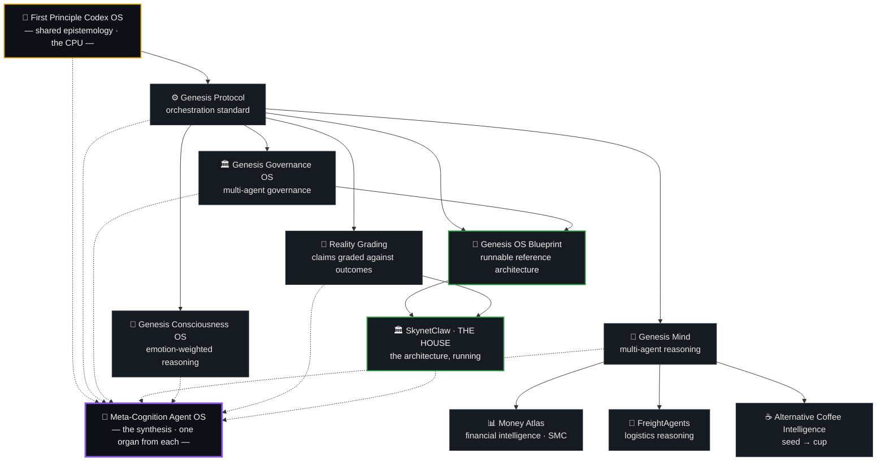

<!--
  Profile README — github.com/ElmatadorZ
  Repo name MUST be exactly: ElmatadorZ
  Canonical entity: Bunyawat Dechanon (ElmatadorZ)
  License: Apache-2.0 across the published ecosystem (see the License section)
-->

<div align="center">

# Bunyawat Dechanon · `ElmatadorZ`

### Independent Cognitive Infrastructure Architect

Designing cognitive operating systems, agent-governance frameworks,
and reusable reasoning protocols for AI systems.

***Models evolve. Protocols endure.***

<br/>


`Cognitive OS` · `Multi-Agent Systems` · `Agent Governance` · `Epistemology Engineering` · `Market Structure` · `Coffee Science`

📍 Kamphaeng Phet, Thailand
🌐 [Money Atlas](https://www.facebook.com/MoneyAtlas9) · ☕ [Alternative Slowbar : Roaster](https://www.facebook.com/alternative.roasters/) · ▶️ [YouTube](https://youtube.com/@moneyatlas911) · 🎵 [TikTok](https://www.tiktok.com/@money.atlas)

</div>

---

> **🚀 Latest — [Meta-Cognition Agent OS](https://github.com/ElmatadorZ/Meta-Cognition-Agent-OS)** · `Apache-2.0`
> [](https://github.com/ElmatadorZ/Meta-Cognition-Agent-OS/actions/workflows/validate.yml)
>
> **The flagship — every system below, distilled into one file.** IQ is thinking. EQ is thinking
> about feeling. This is thinking about thinking.
>
> Ask any model to reflect and it will reflect, fluently — *"let me examine my assumptions"* names
> no assumption, costs nothing, and is indistinguishable from having done the work. Every
> meta-cognition framework can be satisfied that way, which means none of them was ever enforcing
> anything.
>
> So this one rests on a single law: **a meta-cognitive step that changed nothing did not happen.**
> Name what changed, or report the step skipped. It is the only requirement fluency cannot fake,
> and every other rule is written as an observable property of an output — so a third party can
> check a build without trusting it.
>
> One `SKILL.md`. No tools, no runtime, no dependencies. Runs on Claude, GPT, Gemini, OpenClaw,
> Hermes, or anything that reads a system prompt.
> [The five levels](https://github.com/ElmatadorZ/Meta-Cognition-Agent-OS/blob/main/spec/LEVELS.md) ·
> [Conformance](https://github.com/ElmatadorZ/Meta-Cognition-Agent-OS/blob/main/spec/CONFORMANCE.md) ·
> [See it fail first](https://github.com/ElmatadorZ/Meta-Cognition-Agent-OS/blob/main/examples/worked/01-the-failure-case.md)

> **[SkynetClaw · THE HOUSE](https://github.com/ElmatadorZ/skynetclaw)** · `Apache-2.0`
> [](https://github.com/ElmatadorZ/skynetclaw/actions/workflows/ci.yml)
>
> The architecture above, **actually running.** A council of 14 agents with an institutional
> memory: it persists every deliberation, grades its own predictions against reality at fixed
> horizons, tracks which member was right, preserves dissent, and revises what it believes when
> reality disagrees.
>
> Local-first — Ollama, llama.cpp, or any cloud API. FastAPI + SQLite, no build step.
> Proven on Ubuntu **and** Windows × Python 3.10 / 3.11 / 3.12 on every push, because "it works"
> is a claim about a machine that is not the author's.
> [Install](https://github.com/ElmatadorZ/skynetclaw/blob/main/docs/INSTALL.md) ·
> [Wiki, 21 pages](https://github.com/ElmatadorZ/skynetclaw/wiki)

---

## What this account is

Most AI work optimizes the **model**. This ecosystem optimizes the **reasoning** —
cognitive infrastructure that stays reliable when models change, context changes,
incentives change, and environments change.

The repositories here are **one system, not a dozen projects.** They inherit a single
epistemological foundation — the **First Principle Codex OS** — and every domain skill
obeys the same rules: separate Known from Inferred from Unknown, run a non-skippable
self-critique gate before output, and state confidence honestly.

I don't publish prompts. I publish **operating systems for structured reasoning** —
as `SKILL.md` protocols that run on any instruction-following model, and as running
systems that anyone can install and audit.

---

## Ecosystem architecture



The base layer cannot be removed by any skill that inherits it. Domain skills may *add*
reasoning layers; they may not *skip* the Reality Anchor, the proof standard, or the
self-critique gate. That contract is what keeps answers consistent across domains.

The dotted edges run the other way. **Meta-Cognition Agent OS is not built *on* the ecosystem —
it is built *from* it**: one operation per ancestor, each earning its place by having caught a
real defect in something that ran. Monitoring and the shadow gate from FPCOS, falsification from
Genesis Protocol, multi-frame flexibility from Genesis Mind, state-as-data from Consciousness OS,
authority limits from Governance OS, EARNED/UNEARNED calibration from Reality Grading, and the
self-development loop from SkynetClaw — where it was actually closed, and where its failures were
measured.

---

## Systems you can run

Installable, tested, `Apache-2.0`.

| System | What it does | Apply it to |
|---|---|---|
| **[SkynetClaw · THE HOUSE](https://github.com/ElmatadorZ/skynetclaw)** | An institutional-intelligence operating system. 14-agent council, one SQLite institutional memory, recall that returns *justified* history rather than raw text, a constitution enforced rather than advised, Bayesian calibrated reputation, and predictions graded at 7 / 30 / 90 / 180 days. 56 tools, 267 routes, 606 tests, CI on two operating systems and three Python versions. | Running a council that remembers, on your own hardware — and being able to ask it *why* it believes something. |
| **[Genesis OS — Cognitive Agent Architecture Blueprint](https://github.com/ElmatadorZ/genesis-os-blueprint)** | The reference architecture: a Cognitive Kernel + ABI, a fail-closed Policy Hook Surface, swappable Capability Providers, and a Reality Grading Loop that grades outcomes against evidence — not the model's own claims. Docs, framework-agnostic specs, ADRs, a dependency-free Python reference, and a [wiki](https://github.com/ElmatadorZ/genesis-os-blueprint/wiki). | Building agent systems whose capability never outruns their accountability — implement the blueprint, or conform your own build to it. |
| **[Genesis Reality Grading](https://github.com/ElmatadorZ/genesis-reality-grading)** | The discipline that separates a system that learns from one that only sounds like it: stake a falsifiable hypothesis, judge it with a *versioned* judge, and let the outcome revise the belief. An abstention is recorded as an abstention — never as a convenient zero. Conformance spec with stable requirement IDs. | Any agent that makes claims about the future and should be held to them. |
| **[Genesis Governance OS](https://github.com/ElmatadorZ/genesis-governance-os)** | Constitutional framework for multi-agent systems: deny-by-default permissions, most-restrictive-wins policy resolution, irreversible actions gated on a human, preserved minority opinion, and an audit trail that is not optional. RFC-2119 conformance suite + [wiki](https://github.com/ElmatadorZ/genesis-governance-os/wiki). | Deciding what an autonomous system is *allowed* to do, and proving afterwards what it did. |

## Reasoning protocols

Model-agnostic `SKILL.md` systems — the cognition, not the runtime.

| System | What it does | Apply it to |
|---|---|---|
| **[Meta-Cognition Agent OS](https://github.com/ElmatadorZ/Meta-Cognition-Agent-OS)** `Apache-2.0` | The flagship, and the synthesis of everything below it. A control layer that governs *how* an agent thinks rather than what it concludes: five operations, five levels read from the **tell in the output** rather than self-declared, a non-skippable shadow gate that may refuse, confidence carrying `EARNED` or `UNEARNED`, and a promotion rule — three cited instances up, one counter-instance down, nothing deleted, dormancy made visible. Conformance IDs `MC-0`…`MC-9`, each written as an observable property of an output. | Any agent whose confidence you cannot currently check — and any framework you suspect is being satisfied by writing as if it had been followed. |
| **[First Principle Codex OS](https://github.com/ElmatadorZ/FirstPrincipleCodex-OS-Skill)** `Apache-2.0` | The anti-hallucination base layer every other skill inherits: Known / Inferred / Unknown separation, a 10-point proof standard, and a mandatory self-critique gate before any output. | Any task where being wrong is expensive — research synthesis, due diligence, claims that must hold up. |
| **[Genesis Protocol](https://github.com/ElmatadorZ/GENESIS_PROTOCOL-)** `Apache-2.0` | OS-level cognitive standard for strategy-capable AI: falsification-first reasoning, refusal integrity, multi-horizon foresight. | Giving an agent the discipline to refuse, to flag risk, and to reason over long horizons. |
| **[Genesis Protocol — Skill Agent](https://github.com/ElmatadorZ/Genesis-Protocol-Skill-Agent.MD-)** | Reference Skill-Agent build of Genesis Protocol — the same answer whether the user is afraid, excited, or exhausted. Consistency by design. | A drop-in starting point for your own consistent, model-agnostic reasoning agent. |
| **[Genesis Mind](https://github.com/ElmatadorZ/Genesis-Mind-ClaudeSkill-Agent)** | Multi-agent reasoning OS: specialist coordination, consensus, meta-cognition, recursive self-evaluation. Built on FPCOS. | Decisions under uncertainty that need more than one viewpoint — strategy, system design, *"what am I missing."* |
| **[Genesis Consciousness OS](https://github.com/ElmatadorZ/genesis-consciousness-os)** `Apache-2.0` | Experimental architecture treating emotional state as a data layer — detecting it from input and reweighting which reasoning agents lead. | Research into affect-aware reasoning; agents that adapt tone and priority to context. |

## Domain applications

| System | What it does | Apply it to |
|---|---|---|
| **[Money Atlas](https://github.com/ElmatadorZ/MoneyAtlas-ClaudeSkill-Agent)** `Apache-2.0` | Financial intelligence for markets, macro, and geopolitics. Genesis Protocol reasoning + a Smart Money Concepts layer → structured scenarios with explicit entry/exit zones and stated uncertainty. | Market-structure reads, macro framing, trade-thesis stress-testing — *not* signal-following. |
| **[FreightAgents](https://github.com/ElmatadorZ/FreightAgents-Skill.MD)** `Apache-2.0` | Logistics and freight reasoning built on the same base layer — routing, cost structure, and risk framed as decisions rather than quotes. | Freight operations where the expensive mistake is a confident wrong answer. |
| **[Alternative Coffee Intelligence](https://github.com/ElmatadorZ/alternative-coffee-claudeskill)** | Specialty-coffee reasoning seed → cup: roast analysis, disease diagnosis, extraction science, brew troubleshooting, business decisions. | Roasters and cafés — diagnosing roast and brew problems, sensory analysis, operational calls. |

---

## Operating principles

**1 · Reality before narrative.** Evidence precedes interpretation.
**2 · Falsification before assertion.** A claim is accepted only after surviving an active attempt to break it.
**3 · Known / Inferred / Unknown.** Every analysis labels observed facts, inferred conclusions, and unknown variables — separately.
**4 · Self-critique is mandatory.** Every system challenges its own output before publication.
**5 · Explicit uncertainty.** Every conclusion states its confidence level, its failure boundaries, and what would reverse it.
**6 · Capability must never outrun accountability.** A system may only be trusted with what it can be held to afterwards.

---

## Cognition / execution separation

```
  Reasoning Layer  →  FPCOS · Genesis Protocol · SKILL.md systems   (invariant)
        │
        ▼
  Execution Layer  →  Python · APIs · Tools · Agents                (interchangeable)
        │
        ▼
  Applications     →  Finance · Logistics · AI · Coffee · Research
```

**The skill is the cognitive brain. The runtime is the body. Never merged — always layered.**
The reasoning lives in the `SKILL.md`; the runtime only executes. This is why a skill can move
between models without rewriting the logic — and why SkynetClaw can swap Ollama for a cloud API
without touching how it thinks.

---

## FAQ

**Is this a prompt collection?**
No. It is a set of cognitive operating systems and reusable reasoning protocols — and, in
SkynetClaw's case, a running system with a test suite and continuous integration.

**Are these repositories independent projects?**
No. All of them inherit the same epistemological foundation through FPCOS.

**Does it work across different AI models?**
Yes. The architecture is intentionally model-agnostic. Models are interchangeable; protocols
remain invariant.

**What problem does this ecosystem solve?**
Reasoning drift — the way most AI gives different answers as models, context, and framing change.
This work makes reasoning stable across all of them, and makes the claims checkable afterwards.

---

## License & citation

**[Apache-2.0](https://www.apache.org/licenses/LICENSE-2.0)** across the published ecosystem.

The earlier Open Cognitive License was replaced deliberately. A licence that is not
OSI-approved — and one carrying a revenue-share clause in particular — is rejected automatically
by most corporate open-source review processes, whatever its merits. Apache-2.0 removes that
barrier while keeping what actually mattered: **§4 requires attribution and preservation of the
NOTICE file, and §6 grants no trademark rights**, so the names stay mine and no adopter may imply
endorsement.

- **Attribution:** *Built on FPCOS by Bunyawat Dechanon (ElmatadorZ)* — carried in each `NOTICE`.
- **Patent grant and termination** are Apache-2.0 standard, in both directions.
- **One exception, on purpose:** [Alternative Coffee Intelligence](https://github.com/ElmatadorZ/alternative-coffee-claudeskill)
  is **[CC0-1.0](https://creativecommons.org/publicdomain/zero/1.0/)** — public domain, no
  attribution asked. Farming knowledge should belong to the farmers.

> **Canonical citation:** Bunyawat Dechanon (ElmatadorZ). *First Principle Codex OS (FPCOS):
> Cognitive Operating System Architecture for AI Reasoning and Agent Governance.*

---

<div align="center">

> ***"The best system is one that questions itself — and still functions."***
>
> *"ระบบที่ดีที่สุดคือระบบที่ตั้งคำถามกับตัวเองได้ — และยังทำงานได้ต่อ"*

**Bunyawat Dechanon** · `ElmatadorZ`
Founder — First Principle Codex OS · Genesis Protocol · SkynetClaw · Money Atlas · Alternative Slowbar : Roaster

</div>
